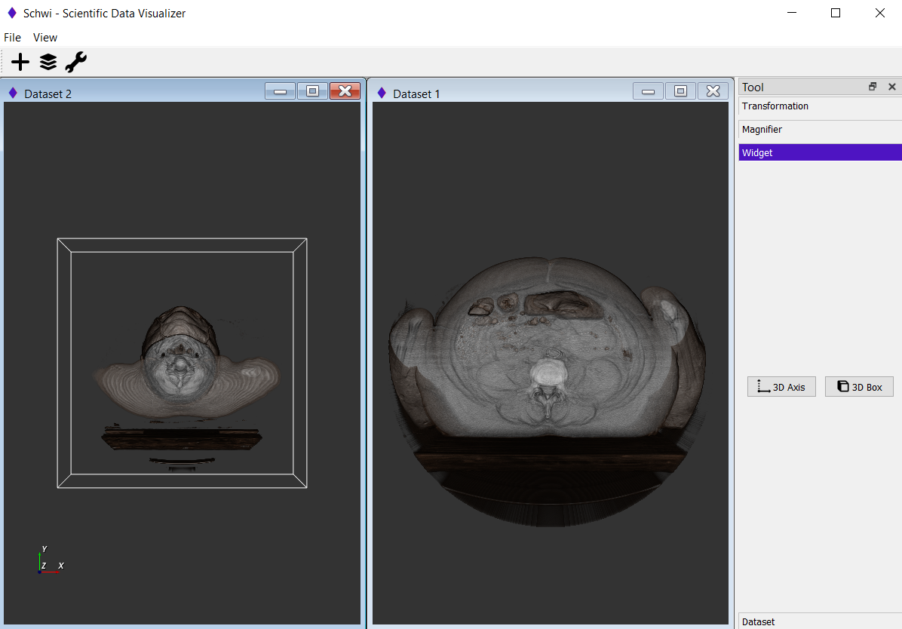

# DICOM_Visualization
SW40103 Assignment 1

## Motivation
------------------
To expose VTK module and technique for reading and visualising scientific datasets in Python.  
To read and visualize various CT Scan data from the provided dataset.

## Features
------------------
- Standard transformation features (Translate, Rotate, Scale) 
- Magnifier (Zoom in and Zoom out) 
- Dataset information 
- 3D axis 
- 3D bounding box 
- Multiple window

## Dataset Link
------------------
https://mri.radiology.uiowa.edu/visible_human_datasets.html  
**notes**: download the .tar files and copy all CT scan images into your project directory

## Dependencies
------------------
- vtk
- PyQt5 
- PySide2

## Screenshot
------------------
 
